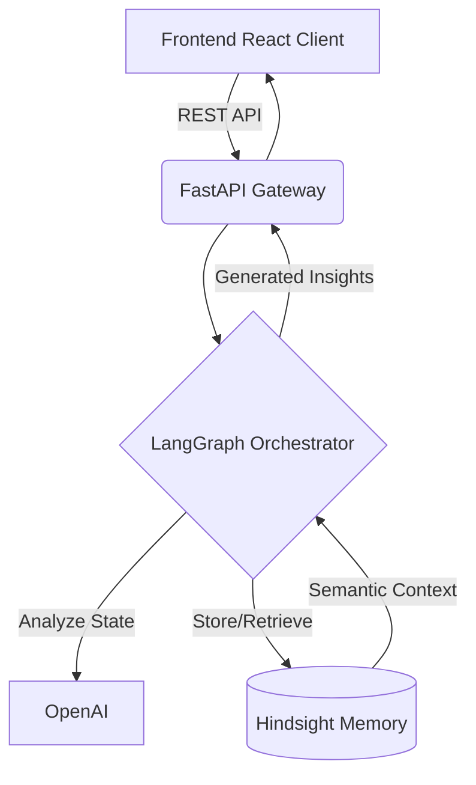
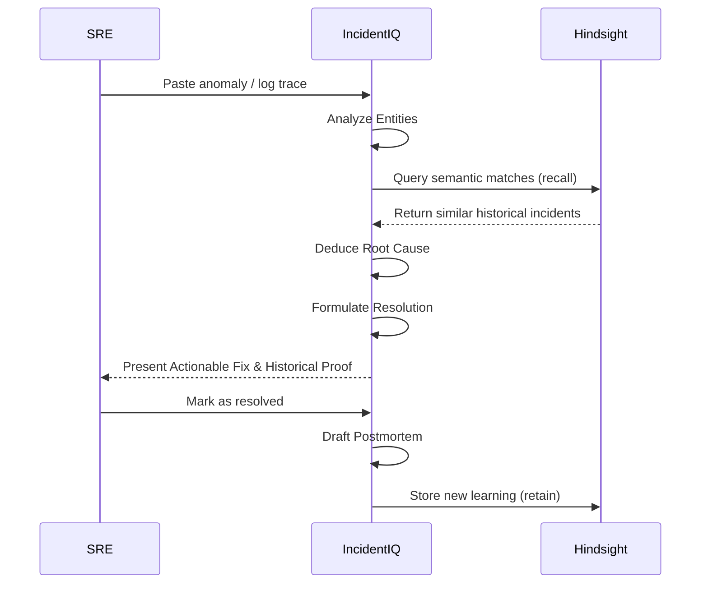

<div align="center">
  
# IncidentIQ

**The AI SRE Copilot That Remembers Every Outage**

[](https://opensource.org/licenses/MIT)
[](https://fastapi.tiangolo.com)
[](https://reactjs.org/)
[](https://www.typescriptlang.org/)
[](https://vectorize.io)

🚀 **Live Demo:** [https://incident-iq-gtdi.vercel.app](https://incident-iq-gtdi.vercel.app)

IncidentIQ is an AI-powered SRE Copilot designed to help engineering teams learn from historical incidents and reduce incident resolution time by natively leveraging semantic memory search.

</div>

---

## 1. The Problem

Modern engineering teams lose critical operational knowledge across a fragmented landscape of tools:
- Buried in **Slack** threads
- Stale in **Notion** runbooks
- Disconnected in **Jira** tickets
- Forgotten in Google Docs **Postmortems**
- Scattered across **Dashboards**

During an active, high-severity outage, engineers are forced to repeatedly ask: **"Have we seen this before?"**

This fragmentation is expensive. Repeating the diagnostic steps of a previous outage directly multiplies downtime and burns out engineers.

---

## 2. The Solution

IncidentIQ operates on a simple principle: **The system should never forget a failure.**

Instead of acting as a stateless chatbot, IncidentIQ natively integrates with vector memory to create a continuous learning loop. 

- **Incident Analysis:** Ingests raw logs, traces, and metrics.
- **Memory Retrieval:** Semantically queries the vector memory bank for historical outages resembling the current anomaly.
- **Root-Cause Intelligence:** Synthesizes retrieved memories to pinpoint the probable failure mechanism.
- **Resolution Formulation:** Recommends proven remediation steps that worked in the past.
- **Postmortem Generation:** Drafts structured, blameless postmortems.
- **Continuous Learning:** Injects the newly generated postmortem back into the vector memory bank to permanently expand its intelligence.

---

## 3. Why Hindsight

IncidentIQ uses **Hindsight** as its core long-term memory layer. 

Every resolved incident is retained inside a Hindsight memory bank, allowing future incidents to retrieve similar historical failures through semantic search. 

This infrastructure enables:
* **Faster root cause analysis** by correlating live anomalies to past bugs.
* **Reuse of proven resolutions** instead of debugging from scratch.
* **Organizational knowledge retention** even as team members change.
* **Continuous learning from past outages** to proactively identify deployment risks.

---

## 4. Key Features

- 🤖 **AI Incident Copilot:** An interactive, context-aware agent for live incident triage.
- 🧠 **Hindsight Memory Integration:** Persistent, semantic vector storage for operational history retention.
- 🔍 **Similar Incident Retrieval:** Instantly correlates active alerts with historically resolved outages.
- 🚀 **Deployment Risk Assessment:** Analyzes proposed PR diffs against historical incidents to predict deployment failure risk.
- 📝 **Automated Postmortem Generation:** Automated drafting of blameless incident reports stored back to memory.
- 📊 **Organizational Learning Dashboard:** High-level analytics tracking system reliability and memory growth.
- 🔄 **Multi-Agent Architecture:** A LangGraph-orchestrated swarm of specialized sub-agents.

---

## 5. Architecture

IncidentIQ leverages a decoupled, state-driven architecture centered around retrieval-augmented workflows.



---

## 6. Workflow



---

## 7. Tech Stack

**Frontend:**
- React 18
- TypeScript
- Tailwind CSS
- Recharts

**Backend:**
- FastAPI (Python 3.13)
- LangGraph (Agentic Orchestration)

**Memory & AI:**
- Vectorize Hindsight Cloud
- OpenAI (`gpt-4o-mini`)

**Infrastructure:**
- Vercel (Frontend & Serverless Backend)

---

## 8. Repository Structure

```text
incidentiq/
├── backend/                  # FastAPI & LangGraph Backend
│   ├── requirements.txt      
│   ├── .env.example          
│   └── app/
│       ├── api/routers/      # REST Endpoints
│       ├── agents/           # Specialized LangGraph Agents
│       ├── services/         # Hindsight & LLM Integration
│       ├── workflows/        # State and Graph execution
│       └── schemas/          # Pydantic data validation
├── frontend/                 # React + Vite Application
│   └── src/
│       ├── components/       # UI Primitives & Layouts
│       ├── features/         # Domain-Driven Modules (memory, incident, etc)
│       └── services/         # API Clients
└── docs/                     # Technical specifications & architecture
```

---

## 9. Installation

### Backend Setup
```bash
cd backend
python -m venv venv
source venv/bin/activate
pip install -r requirements.txt
```

### Frontend Setup
```bash
cd frontend
npm install
```

---

## 10. Environment Variables

Create a `.env` file in the `backend/` directory based on the provided template:

```env
# backend/.env.example
OPENAI_API_KEY=sk-proj-xxxxxxxxxxxxxxxxxxxxxxxxxxxxxxxx
HINDSIGHT_API_KEY=vec_xxxxxxxxxxxxxxxxxxxxxxxxxxxxxxxx
HINDSIGHT_BASE_URL=https://api.hindsight.vectorize.io
HINDSIGHT_MEMORY_BANK=incidentiq-prod
```

> [!WARNING]
> Never commit your live `.env` file to version control. IncidentIQ strictly uses `.env.example` for templating to prevent secret exposure.

---

## 11. Running Locally

**Start the Backend:**
```bash
cd backend
source venv/bin/activate
uvicorn app.main:app --reload --port 8000
```

**Start the Frontend:**
```bash
cd frontend
npm run dev
```
The application will be accessible at `http://localhost:5173`.

---

## 12. Demo Scenario: The Value of Memory

### Without Memory (Standard LLM)
*User:* "The API Gateway container is crash looping with exit code 137."
*Standard LLM:* "Exit code 137 means Out of Memory (OOM). Check your memory limits or look for memory leaks in your code." *(Generic, unhelpful).*

### With IncidentIQ (Hindsight Memory)
*User:* "The API Gateway container is crash looping with exit code 137."
*IncidentIQ:* "I retrieved **INC-405** from our memory bank. Three weeks ago, we saw identical OOM kills on the API Gateway due to an unpaginated internal query to the User Service. 
**Root Cause:** The `GET /users/bulk` endpoint is pulling too many records into memory.
**Recommended Fix:** Revert PR #892 or implement cursor-based pagination immediately.
**Confidence:** 96%"

---

## 13. Hindsight Memory Deep Dive

Memory is the core intelligent layer of IncidentIQ. The application uses Hindsight SDK operations to seamlessly manage historical context:

- **`client.retain`:** Automatically called at the end of every resolved incident. It serializes the postmortem and pushes it into the memory bank for permanent vector storage.
- **`client.recall`:** Executes synchronously during an active incident triage. It converts the SRE's input into an embedding and performs a semantic search against historical outages to provide context to the LLM.
- **Continuous Learning Loop:** Because every resolution triggers a `retain` call, IncidentIQ surfaces increasingly relevant historical context as organizational knowledge grows.

---

## 14. Security

IncidentIQ is designed with security best practices in mind:
- **Secret Management:** Strict isolation of API keys. No hardcoded credentials.
- **Environment Isolation:** `.env` files are aggressively git-ignored.
- **Input Validation:** All frontend inputs are heavily typed via TypeScript and strictly validated via Pydantic on the FastAPI backend before reaching the LLM or Vector store.
- **Error Handling:** Global exception handlers prevent stack trace leakage to the client, utilizing structured server-side logging instead.

---

## 15. Roadmap

The following integrations and capabilities are planned for future development:
- [ ] **Slack Integration:** Bi-directional sync for triggering IncidentIQ directly from `#incidents` channels.
- [ ] **Jira Integration:** Auto-create and populate tickets based on Root Cause findings.
- [ ] **Datadog & Grafana:** Direct ingestion of metric anomalies.
- [ ] **Kubernetes Operator:** Autonomous deployment rollbacks based on Deployment Risk Predictor scores.

---

## 16. Links

**Live Demo:**
https://incident-iq-gtdi.vercel.app

**GitHub Repository:**
https://github.com/karanscosmo/IncidentIQ

---

## 17. Contributors

- **IncidentIQ Team**

---

## 18. License

This project is licensed under the [MIT License](LICENSE).
