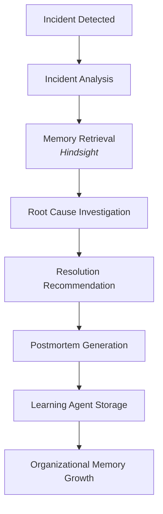

<div align="center">
  
# IncidentIQ

**The AI SRE Copilot That Remembers Every Outage**

[](https://opensource.org/licenses/MIT)
[](https://fastapi.tiangolo.com)
[](https://reactjs.org/)
[](https://www.typescriptlang.org/)
[](https://vectorize.io)

🚀 **Live Demo:** [https://incident-iq-gtdi.vercel.app](https://incident-iq-gtdi.vercel.app)

IncidentIQ is an AI-powered SRE Copilot designed to help engineering teams learn from historical incidents and reduce incident resolution time by natively leveraging semantic memory search.

</div>

---

## 🎥 Demo

**Watch the IncidentIQ end-to-end workflow:** [Demo Video](https://youtu.be/UVau0CEMoeo)

This demo showcases the end-to-end IncidentIQ workflow, from incident detection and root cause analysis powered by semantic memory retrieval, to automated resolution recommendation and postmortem generation.

---

## 🏆 Hackathon Submission

**Event:** Bharat Academix CodeQuest Prototype Development

This repository contains our complete submission package, which includes:
- **Source Code** (Frontend, Backend, Agents)
- **Technical Documentation** (Architecture & API in `docs/`)
- **Architecture Overview** (System Design & Workflows)
- **Demo Video** (End-to-End Walkthrough)
- **Presentation Deck** (Available in our submission portal)

---

## 1. Project Overview

**IncidentIQ is a Memory-Powered AI SRE Copilot.** 

Modern engineering teams lose critical operational knowledge across fragmented tools like Slack, Jira, and Notion. During an active outage, engineers are forced to repeatedly ask: *"Have we seen this before?"*

At the core of IncidentIQ is its **Hindsight Memory** intelligence layer. Unlike traditional tools or stateless chatbots, our system learns continuously from historical incidents. **Every incident becomes organizational knowledge.** When an anomaly occurs, IncidentIQ semantically queries its memory bank to identify similar past outages, leveraging the lessons learned to accelerate triage and resolution.

---

## 2. Why IncidentIQ Matters

IncidentIQ fundamentally changes how engineering teams respond to outages:
- **Faster incident resolution** by instantly surfacing past fixes.
- **Reduced MTTR (Mean Time To Recovery)** through context-aware troubleshooting.
- **Knowledge retention** across team members and time.
- **Organizational learning** via an automated, closed-loop process.
- **Reduced dependency on tribal knowledge** by decentralizing operational insights.

---

## 3. End-to-End Workflow

IncidentIQ orchestrates a seamless flow from failure to organizational learning:



---

## 4. Demo Scenario

**Incident:**
*"Payment API latency increased to 1200ms"*

**IncidentIQ Response:**
1. **Analyzes incident:** Parses the latency spike alert and trace data.
2. **Retrieves similar incidents:** Queries Hindsight and finds a matching incident from two months ago caused by an unindexed database query.
3. **Identifies likely root cause:** Highlights the specific slow query in the Payment API.
4. **Suggests resolution steps:** Recommends applying the previously successful index migration.
5. **Generates postmortem:** Once resolved, drafts a postmortem detailing the latency spike and fix.
6. **Stores new learning:** The Learning Agent commits this new incident context back into memory, reinforcing organizational knowledge.

---

## 5. Architecture

IncidentIQ uses a decoupled, state-driven architecture centered around LangGraph-orchestrated workflows. Intelligence is distributed across specialized AI agents:

- **Incident Analyzer Agent:** Parses incoming anomalies, logs, and metrics to understand the current state.
- **Memory Retrieval Agent:** Queries the Hindsight Memory bank for historically similar incidents.
- **Root Cause Agent:** Synthesizes current data and retrieved memory to pinpoint the probable failure mechanism.
- **Resolution Agent:** Formulates proven, actionable remediation steps based on past successes.
- **Postmortem Agent:** Drafts comprehensive, structured, blameless postmortems upon resolution.
- **Learning Agent:** Extracts core learnings from the postmortem and stores them back into Hindsight to expand organizational knowledge.

---

## 6. Hindsight Memory

**Hindsight Memory** is the central nervous system of our continuous learning loop. We keep this layer highly visible because it is the key innovation of IncidentIQ.

- **Memory Storage:** Postmortems and incident resolutions are embedded and stored in a specialized vector bank.
- **Memory Retrieval:** When an anomaly is detected, the system performs a semantic search (`client.recall`) to instantly recall relevant past incidents.
- **Similar Incident Search:** Instantly correlates active alerts with historically resolved outages.
- **Continuous Learning Loop:** Every resolved incident triggers a `retain` operation, perpetually expanding the system's intelligence without manual runbook updates.

---

## 7. Key Features

- **Incident Copilot:** An interactive, context-aware AI agent for live incident triage.
- **Organizational Memory:** Persistent vector storage of operational history.
- **Similar Incident Search:** Instantly correlates active alerts with historically resolved outages.
- **Deployment Risk Prediction:** Analyzes proposed changes against historical failures to assess deployment failure risk.
- **Postmortem Generation:** Automatically drafts blameless postmortems post-incident.
- **Learning Loop:** Continuously ingests new resolutions to improve future accuracy.
- **Analytics Dashboard:** High-level tracking of system reliability and memory growth.

---

## 8. Tech Stack

**Frontend:**
- React 18
- TypeScript
- Tailwind CSS

**Backend:**
- FastAPI (Python 3.13)

**AI & Agents:**
- LangGraph (Agentic Orchestration)
- OpenAI (`gpt-4o-mini`)

**Memory Layer:**
- Vectorize Hindsight Cloud

**Database:**
- Vectorize Hindsight (Vector Storage)

**Deployment:**
- Vercel (Frontend & Serverless Backend)

---

## 9. Project Structure

```text
incidentiq/
├── backend/                  # FastAPI & LangGraph Backend
│   └── app/
│       ├── agents/           # Specialized LangGraph Agents
│       ├── services/         # Memory & LLM Integration
│       └── workflows/        # State and Graph execution
├── frontend/                 # React + Vite Application
│   └── src/
│       ├── components/       # UI Primitives & Layouts
│       └── features/         # Domain-Driven Modules
├── docs/                     # Technical specifications & architecture
├── infra/                    # Infrastructure definitions
├── scripts/                  # Utility scripts
└── tests/                    # Testing suite
```

---

## 10. Screenshots

*(UI screenshots and interface demonstrations are available in our submission video and presentation deck.)*

---

## 11. Future Roadmap

- **Slack Integration:** Bi-directional sync for triggering IncidentIQ directly from channels.
- **Jira Integration:** Auto-create and populate tickets based on Root Cause findings.
- **Datadog Integration:** Direct ingestion of metric anomalies.
- **Advanced Predictive Analytics:** Improved deployment risk prediction heuristics.
- **Enhanced Memory Intelligence:** Multi-modal memory retrieval including metrics and graphs.

---

## 12. Local Setup

### Backend
```bash
cd backend
python -m venv venv
source venv/bin/activate
pip install -r requirements.txt
cp .env.example .env # Add your OpenAI & Hindsight keys
uvicorn app.main:app --reload --port 8000
```

### Frontend
```bash
cd frontend
npm install
npm run dev
```

---

<div align="center">

## The AI SRE Copilot That Remembers Every Outage

*IncidentIQ's vision is to build an autonomous infrastructure intelligence layer that ensures engineering teams never have to solve the same problem twice.*

</div>
